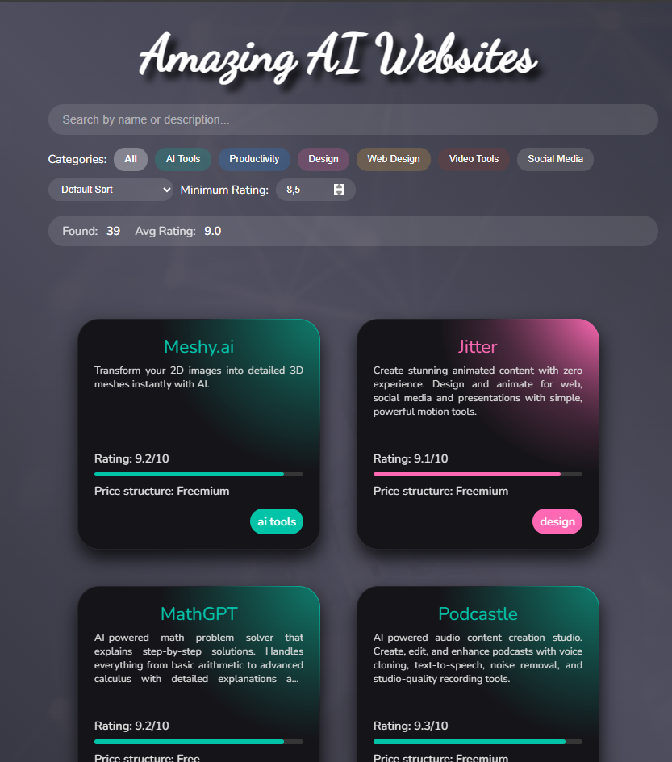

# theBestAITools# AI Tools Collection

Eine interaktive Webseite zur Darstellung und Filterung verschiedener KI-Tools. Die Anwendung ermöglicht es Benutzern, KI-Tools nach verschiedenen Kriterien zu durchsuchen, zu filtern und zu sortieren.



## Features

- 🔍 Dynamische Suchfunktion
- 🏷️ Kategoriefilter mit farblicher Kennzeichnung
- ⭐ Bewertungsfilter
- 📊 Sortieroptionen (Name, Bewertung)
- 📱 Responsives Design
- 💫 Animierte Karten-Layouts
- 📈 Live-Statistiken

## Technologien

- HTML5
- CSS3 (mit Custom Properties und Flexbox)
- JavaScript (Vanilla)
- PapaParse für CSV-Verarbeitung
- Google Fonts (Nunito & Dancing Script)

## Projektstruktur
root/
│
├── index.html          # Hauptdatei
├── index.css          # Haupt-Styling
├── filters.css        # Filter-Komponenten Styling
├── script.js         # JavaScript Logik
├── cards.csv         # Daten der KI-Tools
├── colors.csv        # Farbschema für Kategorien
└── screenshot.png    # Vorschaubild der Anwendung

## Installation

1. Repository klonen:
   ```bash
   git clone https://github.com/hansdietergross/theBestAITools.git
   
