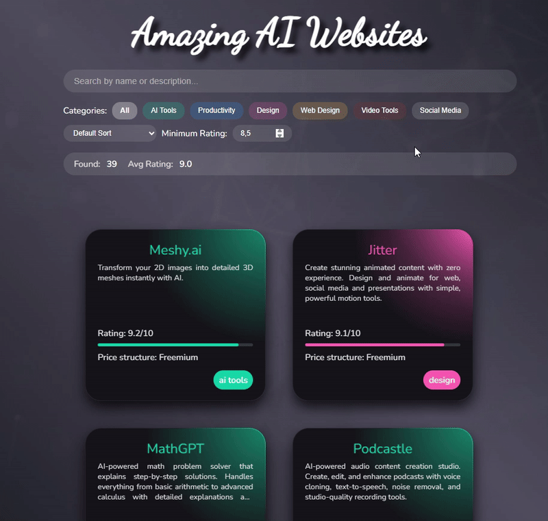

# AI Tools Collection

An interactive website for displaying and filtering various AI tools. The application allows users to search, filter, and sort AI tools by different criteria.

**Important Note**: This project focuses solely on the technical implementation and visualization of data. The content consists of test data only. Neither the content nor the functionality of the listed tools has been verified!

## Technologies

## Features

- 🔍 Dynamic search functionality
- 🏷️ Category filters with color coding
- ⭐ Rating filter
- 📊 Sorting options (name, rating)
- 💫 Animated card layouts
- 📈 Live statistics

Project Structure

index.html - Main file
index.css - Main styling
filters.css - Filter components styling
script.js - JavaScript logic
cards.csv - AI tools data
colors.csv - Category color scheme
screenshot.png - Application preview

Installation

Clone repository:
bashCopygit clone https://github.com/hansdietergross/theBestAITools.git

Start a local server (e.g., using Live Server in VS Code)
Open index.html in your browser

Data Structure
cards.csv
Contains information about AI tools:

name: Tool name
description: Description
rating: Rating (0-10)
price: Price structure
category: Category
website: URL

colors.csv
Defines the color scheme for categories:

color: Hex color code
category: Category name
gradient: Gradient style

Usage

Use the search bar to find tools
Filter by categories using the buttons
Set a minimum rating value
Sort results by different criteria
